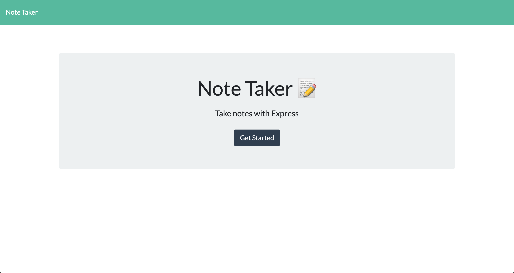
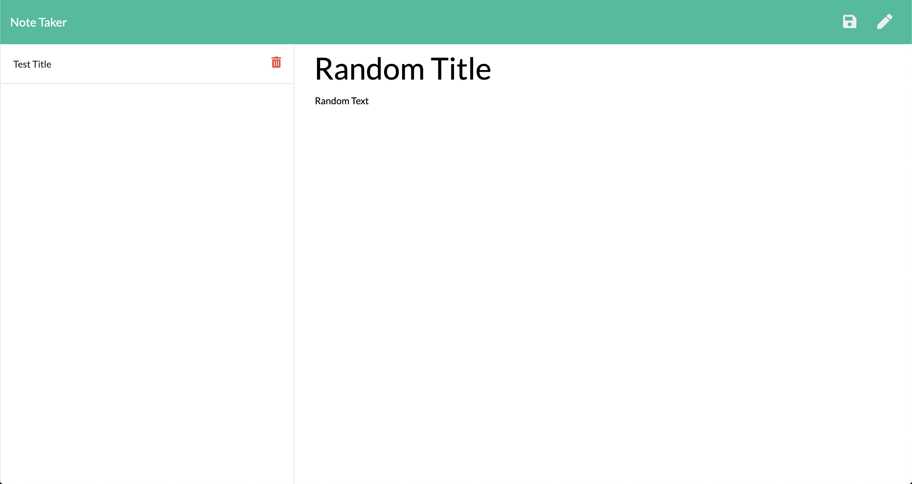

# note-taker
 
## Description
With the use of Express.js, this note taker app can be used to read, write and save notes to a server. The app server takes in get request to be able to show user content. Server can also take in post request to be able to post new notes into the server. Finally, the server takes delete request to be able to remove a given note.

## Installation/Usage
Deployed note-taker app can be found [Here](https://immense-wildwood-54702.herokuapp.com/)

If running on localhost please ensure to d othe following: 
* Run `npm start`
* To run code type `npm start`
* Open browser and go to [http://localhost:3000/](http://localhost:3000/)

Below are images of deployed app  
  

## License

MIT License

Copyright (c) 2020 Alex Bailon

Permission is hereby granted, free of charge, to any person obtaining a copy of this software and associated documentation files (the "Software"), to deal in the Software without restriction, including without limitation the rights to use, copy, modify, merge, publish, distribute, sublicense, and/or sell copies of the Software, and to permit persons to whom the Software is furnished to do so, subject to the following conditions:

The above copyright notice and this permission notice shall be included in all copies or substantial portions of the Software.

THE SOFTWARE IS PROVIDED "AS IS", WITHOUT WARRANTY OF ANY KIND, EXPRESS OR IMPLIED, INCLUDING BUT NOT LIMITED TO THE WARRANTIES OF MERCHANTABILITY, FITNESS FOR A PARTICULAR PURPOSE AND NONINFRINGEMENT. IN NO EVENT SHALL THE AUTHORS OR COPYRIGHT HOLDERS BE LIABLE FOR ANY CLAIM, DAMAGES OR OTHER LIABILITY, WHETHER IN AN ACTION OF CONTRACT, TORT OR OTHERWISE, ARISING FROM, OUT OF OR IN CONNECTION WITH THE SOFTWARE OR THE USE OR OTHER DEALINGS IN THE SOFTWARE.